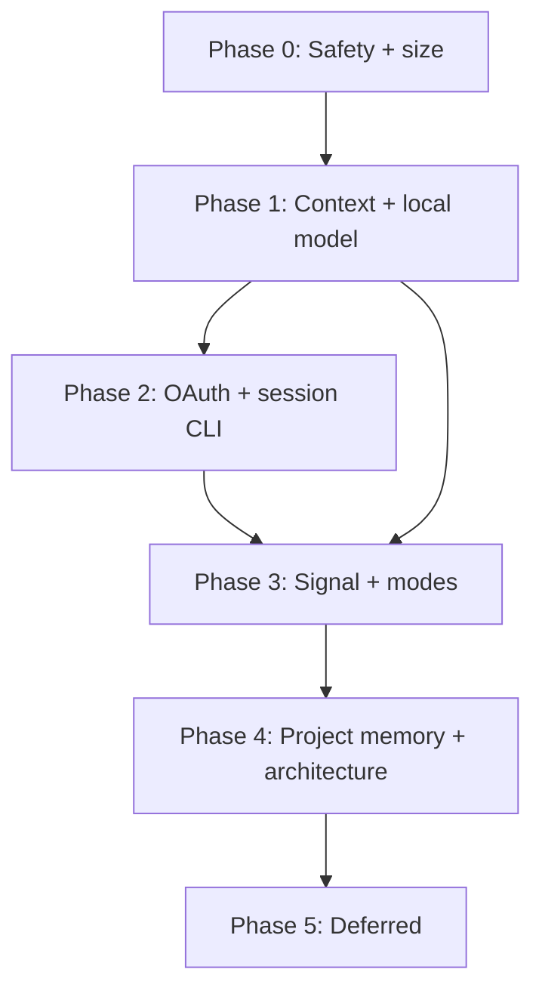

# Master Plan: smolclaw Feature & Improvement Roadmap

**Status**: Executing — **Phase 0 & 1 complete; most Phase 2 & 3 READY tasks landed (2026-06-27)** on `master` (HEAD `98b1de9`). Remaining: Phase 2 — 2.1/2.2 xAI OAuth + 2.12 MCP cookbook (GATED-EXT); Phase 3 — 3.9 silent tokens (READY), 3.5 notify (optional), 3.1 Signal MVP (GATED-EXT). 2.5 skipped.  
**Author**: Consolidated from cross-repo analyses (2026-03 through 2026-05)  
**Last Updated**: 2026-06-27  
**Related**: Individual phase plans in `docs/design/phases/`, source design docs listed below  
**Hermes gap analysis**: Tier map in §4.3 (2026-06 comparative roadmap)  
**Autonomy handoff**: per-task ready/gated matrix + open-question checklist in [`autonomy-readiness.md`](autonomy-readiness.md)

---

## 1. Purpose

This document is the **single index** for all planned smolclaw improvements gathered from design docs, comparative analyses, audit reports, and backlog items. It captures:

- What each plan proposes
- Rough code and binary size impact
- Alignment with the **smol** philosophy (small binaries, Kconfig modularity, lean codebase)
- Recommended execution order from a **risk-minimization** perspective

Detailed task breakdowns live in **phase plans** (`docs/design/phases/phase-*.md`). Source design documents remain authoritative for individual features.

---

## 2. Guiding Principles ("smol" contract)

Every item in this roadmap must satisfy:

1. **Optional by default where size matters** — Kconfig `default n` or runtime config off for features adding >~50 KB.
2. **No new runtime dependencies** — reuse curl, libevent, cJSON, SQLite, existing util code.
3. **Reuse infrastructure** — channels use `base.c`, tools use registry/sandbox, auth follows `x_api.c` / vault patterns.
4. **Ship in slices** — MVP first; Phase 2/3 items stay out of early PRs.
5. **Security never regresses** — Landlock, seccomp, pairing, audit log, path validation stay intact.

**Binary budget rule:** treat **+50 KB per optional feature** as a warning threshold; require Kconfig gating above that.

**LOC budget rule:** aim for **≤2,000 LOC net** across Phase 0–2 before starting Phase 3 optional surface area.

---

## 3. Source Documents Index

- **[`code-analysis-report.md`](../../code-analysis-report.md)** — Status: Audit remediation;
  Phase(s): 0; Notes: 35 findings; 11 high
- **[`todo.md`](../../todo.md)** — Status: Backlog; Phase(s): 0, 3, 4, 5; Notes: Size opts,
  microsandbox, small fixes
- **[`docs/plan-checkpoint-rewind.md`](../plan-checkpoint-rewind.md)** — Status: Ready; Phase(s): 0;
  Notes: ~100 LOC agent loop
- **[`docs/claude-code-improvements.md`](../claude-code-improvements.md)** — Status:
  Recommendations; Phase(s): 1, 4, 5; Notes: ~380–800 LOC
- **[`docs/design/smallharness-integration.md`](smallharness-integration.md)** — Status: Design
  complete; Phase(s): 1, 3, 4, 5; Notes: Local-model patterns
- **[`docs/design/xai-grok-oauth.md`](xai-grok-oauth.md)** — Status: Design complete; Phase(s): 2;
  Notes: <650 LOC cap
- **[`docs/design/deferred-initialization.md`](deferred-initialization.md)** — Status: Spec complete;
  Phase(s): 0; Notes: Hermes PR pattern lift; RSS/startup
- **[`docs/design/mixture-of-agents.md`](mixture-of-agents.md)** — Status: Design complete;
  Phase(s): 2; Notes: Hermes MoA-lite; virtual provider; `SC_ENABLE_MOA` default n
- `docs/integrations/mcp-cookbook.md` *(not yet created — authored as the Phase 2.12 deliverable)* —
  Status: Planned; Phase(s): 2; Notes: Tier 2 MCP delegation (browser, HA, media)
- **[`lazyagent_borrow_tasks.md`](../../lazyagent_borrow_tasks.md)** — Status: Pattern lifts;
  Phase(s): 2; Notes: Session CLI
- **[`docs/zed-patterns-actionable.md`](../zed-patterns-actionable.md)** — Status: Recommendations;
  Phase(s): 0, 2, 4, 5; Notes: 6 architectural tasks
- **[`docs/design/signal-channel.md`](signal-channel.md)** — Status: Design complete; Phase(s): 3,
  5; Notes: Kconfig `default n`
- **[`docs/channels/signal.md`](../channels/signal.md)** — Status: User doc (planned); Phase(s): 3;
  Notes: Mirror of Signal design
- **[`grok-cli-vs-smolclaw.md`](../../grok-cli-vs-smolclaw.md)** — Status: Comparative; Phase(s): 5;
  Notes: Mostly skip TUI
-
  **[`docs/development/using-grok-implement-skill.md`](../development/using-grok-implement-skill.md)**
  — Status: Process; Phase(s): —; Notes: How to implement designs

**Not in roadmap** (implemented or out of scope):

- `docs/tools/code_graph.md`, `docs/implementation-notes/phase3-code-graph-landing-2026-05-18.md` — shipped
- Progress reports (`docs/progress-*.md`) — historical
- `README.md`, `SECURITY.md`, `RELEASING.md` — operational docs

---

## 4. Consolidated Inventory

### 4.1 By theme

- **Reliability & safety** — Items: Audit fixes, arena allocator, sc_task_t, checkpoint rewind;
  Primary sources: code-analysis, zed-patterns
- **Binary lean** — Items: LTO/gc-sections, optional FTS5, updater split eval; Primary sources:
  todo.md
- **Context & tokens** — Items: Spill-to-disk, token compaction, old-result compression, adaptive
  tools, warmup; Primary sources: claude-code, smallharness
- **Local models** — Items: Adaptive tools, warmup, stream buffer, compaction, project memory,
  doctor; Primary sources: smallharness
- **Auth & providers** — Items: xAI Grok OAuth, provider health, prompt caching, backoff; Primary
  sources: xai-grok-oauth, zed, claude-code
- **Channels & tools** — Items: Signal MVP, notify extras, X note_tweet; Primary sources:
  signal-channel, todo
- **Session ops** — Items: compact, prune, incremental reload; Primary sources: lazyagent
- **Architecture (large)** — Items: Context pipeline, session index, MCP capability sandbox; Primary
  sources: zed-patterns
- **Security depth** — Items: Microsandbox exec backend; Primary sources: todo.md
- **Explicitly deferred** — Items: Rich TUI, Signal media/SSE, shipcheck/handoff, batch editor;
  Primary sources: grok-cli, smallharness, signal
- **Hermes-gap (Tier 1 core)** — Items: Deferred init, cron parser, gateway slash commands, session
  reset, busy-input, silent tokens, session_search, compact tool; Phase(s): 0–4
- **Hermes-gap (Tier 2 MCP)** — Items: Browser, Home Assistant, media gen via MCP cookbook;
  Phase(s): 2+ parallel
- **Hermes-gap (Tier 4 learning loop)** — Items: Post-turn memory review, staged writes, capacity
  headers; Phase(s): 4.13–4.14; Notes: no `skill_manage` / Skills Hub

### 4.2 Size impact summary

- **Audit high/medium fixes** — **[Highs H-1–H-10 + M-1 SHIPPED; verify H-11/M-3 + tests]**; LOC
  (rough): 50–200; Binary Δ (rough): ~0; Kconfig / config gate: always
- **Binary size optimizations** — LOC (rough): 50–200 (CMake); Binary Δ (rough): **−10–25%**;
  Kconfig / config gate: build profile
- **Optional FTS5** — LOC (rough): 20–50 (CMake); Binary Δ (rough): **−50–200 KB** on minimal;
  Kconfig / config gate: `SC_ENABLE_MEMORY_SEARCH`
- **Checkpoint rewind** — **[SHIPPED — verify-only]**; LOC (rough): 0 (+test); Binary Δ (rough): ~0;
  Kconfig / config gate: always
- **Arena allocator (Zed T1)** — **[PARTIAL — allocator shipped + per-turn wired; provider-parse
  adoption remains]**; LOC (rough): 80–150; Binary Δ (rough): ~0; Kconfig / config gate: always
- **sc_task_t (Zed T2)** — **[SHIPPED — verify M-8 join]**; LOC (rough): 0 (+test); Binary Δ (rough):
  ~5 KB; Kconfig / config gate: always
- **Tool spill + token compaction (P0)** — LOC (rough): 200–350; Binary Δ (rough): +10–20 KB;
  Kconfig / config gate: config
- **SmallHarness Phase A** — LOC (rough): 400–700; Binary Δ (rough): +15–40 KB; Kconfig / config
  gate: `tool_selection`, `warmup` flags
- **xAI Grok OAuth** — LOC (rough): <650; Binary Δ (rough): +40–60 KB; Kconfig / config gate:
  `SC_ENABLE_XAI_OAUTH`
- **Session compact/prune CLI** — LOC (rough): 200–450; Binary Δ (rough): ~5–15 KB; Kconfig / config
  gate: CLI only
- **Provider health (Zed T6)** — **[SHIPPED — verify fallback consults it + surface in analytics]**;
  LOC (rough): 20–60; Binary Δ (rough): ~5 KB; Kconfig / config gate: always
- **Signal channel MVP** — LOC (rough): 800–1,000; Binary Δ (rough): +40–80 KB; Kconfig / config
  gate: `SC_ENABLE_SIGNAL` default **n**
- **SmallHarness Phase B (modes, confirm)** — LOC (rough): 300–500; Binary Δ (rough): +10–20 KB;
  Kconfig / config gate: config
- **MCP capability sandbox (Zed T3)** — LOC (rough): 300–500; Binary Δ (rough): +10–20 KB; Kconfig /
  config gate: config per server
- **Anthropic prompt caching** — LOC (rough): 60–100; Binary Δ (rough): ~5 KB; Kconfig / config
  gate: provider flag
- **Project memory + repo_search** — LOC (rough): 800–1,200; Binary Δ (rough): +50–100 KB; Kconfig /
  config gate: `SC_ENABLE_PROJECT_MEMORY` default **n**
- **Context pipeline (Zed T4)** — LOC (rough): 800–1,200; Binary Δ (rough): neutral/+; Kconfig /
  config gate: refactor
- **Session index (Zed T5)** — LOC (rough): 600–900; Binary Δ (rough): +20–40 KB; Kconfig / config
  gate: optional
- **Microsandbox exec** — LOC (rough): 400–600; Binary Δ (rough): +15–30 KB; Kconfig / config gate:
  `SC_ENABLE_MICROSANDBOX` + external daemon
- **Rich TUI (grok-cli borrow)** — LOC (rough): 2,000+; Binary Δ (rough): +100 KB+; Kconfig / config
  gate: **reject**
- **Deferred runtime init (0.8)** — LOC (rough): 150–250; Binary Δ (rough): ~0 (RSS win); Kconfig /
  config gate: always
- **Gateway slash + cron (2.9–2.10)** — LOC (rough): 280–500; Binary Δ (rough): +10–15 KB; Kconfig /
  config gate: config / `SC_ENABLE_CRON`
- **Mixture of Agents MoA-lite (2.13)** — LOC (rough): 350–550; Binary Δ (rough): +10–20 KB; Kconfig /
  config gate: `SC_ENABLE_MOA` default **n**; spec: `mixture-of-agents.md`
- **Gateway polish (3.7–3.9)** — LOC (rough): 290–460; Binary Δ (rough): +10 KB; Kconfig / config
  gate: config
- **Session search (4.11)** — LOC (rough): 300–500; Binary Δ (rough): +15–25 KB; Kconfig / config
  gate: `SC_ENABLE_SESSION_SEARCH` default **n**
- **Tier 4 memory review (4.13–4.14)** — LOC (rough): 350–600; Binary Δ (rough): +15 KB; Kconfig /
  config gate: config **default off**

Estimates are order-of-magnitude for stripped release builds on x86_64; measure after each phase.

### 4.3 Hermes gap tier map

Cross-reference for [Hermes Agent](https://hermes-agent.nousresearch.com/docs/) comparative
roadmap. **Tiers define where code lives**; **phases define execution order**.

| Tier | Meaning | Where it ships | Examples in this roadmap |
|------|---------|----------------|--------------------------|
| **T1** | Core C binary (Kconfig-gated) | Phases 0–4 | 0.8 deferred init; 2.9–2.11 cron, slash, skills docs; **2.13 MoA-lite**; 3.7–3.9 gateway polish; 4.11–4.12 session_search, compact tool |
| **T2** | MCP subprocess delegation | Parallel from Phase 2 | 2.12 MCP cookbook — browser, HA, image/TTS; zero smolclaw binary cost |
| **T3** | Separate orchestration layer | Never in smolclaw (`SCOPE.md`) | Fleet dashboards, relay for 15+ channels, Desktop/TUI, ACP adapter, RL/Atropos, Skills Hub |
| **T4** | Minimal self-improvement loop | Phase 4.13–4.14 (opt-in) | Post-turn memory review, `write_approval` staging; **not** `skill_manage`, `/learn`, Honcho |

**Closure principle:** selective Hermes parity at the **MCP/config boundary**, not parity at the
Python/Playwright dependency cone.

| Hermes capability | After P0–4 + T2 | Remaining gap |
|-------------------|-----------------|---------------|
| Grok subscription OAuth | Phase 2 | Multi-account pool → Phase 5 |
| Context compression | Phase 1 + 4 | Three API modes — out of scope |
| 7 core channels | Today + Signal P3 | 20+ native adapters impractical |
| Browser / media | T2 MCP (+ optional P4 wrappers) | No in-process Playwright |
| Self-improving loop | T4 subset (4.13–4.14) | skill_manage, Skills Hub → T3 |
| Mixture of Agents | Phase 2.13 (MoA-lite) | Full Hermes UI / unlimited presets → out of core |
| Docker/Modal/Daytona terminals | microsandbox 4.9 + T2 | Six backends — partial by design |

Task IDs: see phase plans — **0.8**, **2.9–2.13**, **3.7–3.9**, **4.11–4.14**.

---

## 5. Smol-Theme Scorecard

> This scorecard categorizes items by **smol-alignment**, not status. Several
> "Strong smol" items have **already shipped** (checkpoint rewind, sc_task_t,
> provider health, arena allocator) — see the `[SHIPPED]`/`[PARTIAL]` markers
> in §4.2 and the phase docs for execution status.


- **Strong smol** — Audit fixes, binary size opts, optional FTS5, deferred init, checkpoint rewind,
  sc_task_t, provider health, port logging, X note_tweet, xAI OAuth (bounded), Signal MVP (Kconfig
  off), silent tokens, cron parser
- **Good if gated** — SmallHarness Phase A–B, claude-code P0/P1, MCP capabilities, session
  compact/prune, gateway slash/reset/queue, session_search, notify extras, Tier 4 memory review
- **Bloat risk** — Project memory, shipcheck/handoff, Zed context pipeline, session index,
  microsandbox ops, Signal Phase 2–3, Rich TUI, steer busy-input, `/background` sessions
- **Tier 2 (zero binary cost)** — MCP cookbook: browser, HA, media — document and delegate
- **Tier 3 (out of repo)** — Fleet relay, Desktop, ACP, Skills Hub, RL trajectories
- **Skip / defer** — grok-cli TUI, OpenRouter compare, SmallHarness batch editor, lazyagent
  multi-format reading

---

## 6. Master Execution Order

Phases are ordered to **minimize regression risk**: foundations first, agent-loop wins before new channels, architectural refactors last.

```text
Phase 0 — Safety & stability     ✓ DONE  docs/design/phases/phase-0-safety-and-stability.md
Phase 1 — Context efficiency     ✓ DONE  docs/design/phases/phase-1-context-efficiency.md
Phase 2 — Operator & provider UX  ~ READY landed; 2.1/2.2 xAI OAuth LIVE-ACCEPTED 2026-06-29; only 2.12 MCP cookbook GATED-EXT
Phase 3 — Optional surface area   ← current; most READY landed; 3.9/3.5/3.1 remain
Phase 4 — Larger investments          docs/design/phases/phase-4-larger-investments.md
Phase 5 — Defer / reject              docs/design/phases/phase-5-defer-reject.md
```

### Phase summary

- **0** — Goal: Fix known bugs; shrink binary; deferred init; checkpoint rewind; LOC budget:
  ~650–1,150; Binary target: Net **smaller** or flat (+ RSS win); Exit criteria: Audit highs closed;
  ctest green; size baseline recorded
- **1** — Goal: Context/token efficiency + local-model quick wins; LOC budget: ~700–1,200; Binary
  target: +≤40 KB default config; Exit criteria: Spill/compaction + SmallHarness Phase A behind
  flags
- **2** — Goal: Auth, session CLI, provider health, gateway slash, MCP cookbook; LOC budget:
  ~1,200–2,000; Binary target: +≤80 KB with OAuth on; Exit criteria: xAI OAuth shippable; session
  compact works; slash MVP + MCP doc published
- **3** — Goal: Kconfig-gated channels, modes, gateway polish; LOC budget: ~1,500–2,100; Binary
  target: +≤80 KB per flag enabled; Exit criteria: Signal MVP; reset/queue/silent tokens; no
  default-on bloat
- **4** — Goal: Memory index, arena, MCP caps, session_search, Tier 4 review; LOC budget:
  ~2,100–3,200; Binary target: gated; Exit criteria: Each item independently shippable; Tier 4
  default off
- **5** — Goal: Parking lot; LOC budget: —; Binary target: —; Exit criteria: Revisit only with
  demand

### Dependency graph (simplified)



---

## 7. Measurement Baseline

Before Phase 0 work, record:

```bash
# Dynamic release build (current default)
cmake -B build -DCMAKE_BUILD_TYPE=Release
cmake --build build -j$(nproc)
ls -la build/smolclaw
# Minimal profile
cp configs/defconfig.minimal .config
cmake -B build-minimal && cmake --build build-minimal -j$(nproc)
ls -la build-minimal/smolclaw
ctest --test-dir build
```

Track in phase-0 doc: binary bytes, peak RSS (optional), test count.

---

## 8. How to Use This Roadmap

1. **Pick a phase** — read the corresponding `docs/design/phases/phase-*.md`.
2. **Implement one slice** — single PR per task group within a phase when possible.
3. **Update status** — mark tasks done in the phase doc; link commits.
4. **Source doc wins on detail** — e.g. Signal behavior = `signal-channel.md`; OAuth security = `xai-grok-oauth.md`.
5. **Implement via skill** — for large features, use prompts from `docs/development/using-grok-implement-skill.md`.

---

## 9. Open Questions (cross-phase) — RESOLVED 2026-06-26

All cross-phase questions are decided; see
[`autonomy-readiness.md` §3](autonomy-readiness.md) for full rationale.

1. Adaptive tools gating → **runtime config only, default `fixed`** (no Kconfig flag). *(Q1)*
2. Project memory index path → **`{SMOLCLAW_HOME}/indexes/{workspace-hash}.json`** (not in-repo). *(Q2)*
3. Async confirm UX → **summary-only confirm, fail-closed**; full diff on CLI/Web only. *(Q3)*
4. Updater split → **no split**; rely on LTO + `--gc-sections` (task 0.4); 4.10 becomes measure-only. *(Q4)*
5. Phase 5 promotion → **demand (3+) AND a measured threshold breach AND P0–3 stable**. *(Q5)*

Spec-level decisions: xAI OAuth `SC_ENABLE_XAI_OAUTH` **default n / `depends on SC_ENABLE_XAI`** (Q6);
`repo_search` **v1 duplicates** extraction, shares with `code_graph` in v2 (Q7).

---

## 10. Document Map

```
docs/design/
  master-plan.md                          ← this file
  phases/
    phase-0-safety-and-stability.md
    phase-1-context-efficiency.md
    phase-2-operator-provider-ux.md
    phase-3-optional-surface-area.md
    phase-4-larger-investments.md
    phase-5-defer-reject.md
  signal-channel.md                       ← authoritative for Signal
  xai-grok-oauth.md                       ← authoritative for OAuth
  smallharness-integration.md             ← authoritative for local-model lifts
  deferred-initialization.md              ← authoritative for lazy runtime init (0.8)
  mixture-of-agents.md                    ← authoritative for MoA-lite virtual provider (2.13)
  integrations/mcp-cookbook.md          ← Tier 2 MCP delegation (NOT YET CREATED; Phase 2.12 deliverable)
```

---

**Next step:** Phase 0 & Phase 1 complete (2026-06-27), landed on `master`. Begin [Phase 2](phases/phase-2-operator-provider-ux.md) — operator & provider UX. Two manual 🟠 acceptances remain from Phase 1: 1.5 (Ollama zero-tool-schema token count) and 1.8 (live TTFT after warmup).
